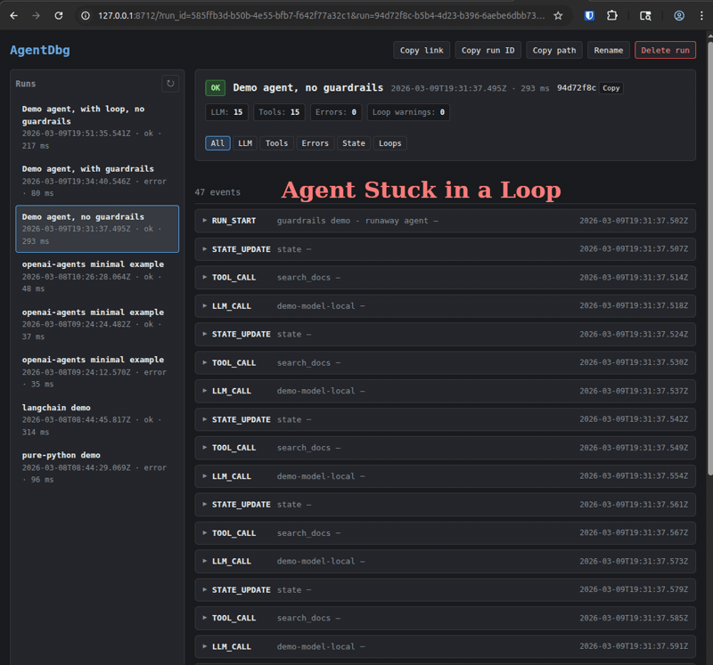

# AgentDbg

**The step-through debugger for AI agents.**

AgentDbg captures a structured trace of every agent run - LLM calls, tool calls, errors, state updates, loop warnings - and gives you a clean local timeline to see exactly what happened.

Add `@trace`, run your agent, then run:

```
agentdbg view
```

In under 10 minutes, you can inspect a full execution timeline with inputs, outputs, status, and failure evidence - all on your machine.

**No cloud. No accounts. No telemetry.**

**Built-in run guardrails:** stop runaway debug sessions when an agent starts looping or exceeds your limits for LLM calls, tool calls, total events, or duration.

<!--  -->


## Get running in 5 minutes

Three commands. No config files, no API keys, no sign-up. Install: `pip install agentdbg`. Then:

1. [Install (one-time)](#step-1-install)
2. [Run example](#step-2-run-the-example-agent)
3. [`agentdbg view`](#step-3-open-the-timeline)

### Step 1: Install

```bash
pip install agentdbg
```

### Step 2: Run the example agent

```bash
python examples/demo/pure_python.py
```

This simulates a tiny agent that makes several tool and LLM calls and includes loop warnings and errors. Trace data lands in `~/.agentdbg/runs/`.

### Step 3: Open the timeline

```bash
agentdbg view
```

A browser tab opens at `http://127.0.0.1:8712` showing the full run timeline - every event, with inputs, outputs, and timing.

<!--  -->


That's it. You're debugging.


## Instrument your own agent

Add three lines to any Python agent:

```python
from agentdbg import trace, record_llm_call, record_tool_call

@trace
def run_agent():
    # ... your existing agent code ...

    record_tool_call(
        name="search_db",
        args={"query": "active users"},
        result={"count": 42},
    )

    record_llm_call(
        model="gpt-4",
        prompt="Summarize the search results.",
        response="There are 42 active users.",
        usage={"prompt_tokens": 12, "completion_tokens": 8, "total_tokens": 20},
    )

run_agent()
```

Then `agentdbg view` to see the timeline.

### What gets captured

| Event | Recorded by | What you see |
|---|---|---|
| Run start/end | `@trace` (automatic) | Duration, status, error if any |
| LLM calls | `record_llm_call()` | Model, prompt, response, token usage |
| Tool calls | `record_tool_call()` | Tool name, args, result, status |
| State updates | `record_state()` | Arbitrary state snapshots |
| Errors | `@trace` (automatic) | Exception type, message, stack trace |
| Loop warnings | Automatic detection | Repetitive pattern + evidence |

### Stop runaway runs with guardrails

Guardrails are opt-in and meant for development-time safety rails: they let you stop an agent when it starts looping or using more budget than intended, while still writing a normal trace you can inspect afterward.

```python
from agentdbg import (
    AgentDbgGuardrailExceeded,
    AgentDbgLoopAbort,
    record_llm_call,
    record_tool_call,
    trace,
)


@trace(
    stop_on_loop=True,
    max_llm_calls=10,
    max_tool_calls=20,
    max_events=80,
    max_duration_s=30,
)
def run_agent():
    ...


try:
    run_agent()
except AgentDbgLoopAbort:
    print("AgentDbg stopped a repeated loop.")
except AgentDbgGuardrailExceeded as exc:
    print(exc.guardrail, exc.threshold, exc.actual)
```

When a guardrail fires, AgentDbg uses the existing lifecycle:

- it records the event that triggered the issue
- it records `ERROR`
- it records `RUN_END(status=error)`
- it re-raises a dedicated exception so your code knows the run was intentionally aborted

Available guardrails:

- `stop_on_loop`
- `stop_on_loop_min_repetitions`
- `max_llm_calls`
- `max_tool_calls`
- `max_events`
- `max_duration_s`

You can set them in `@trace(...)`, `traced_run(...)`, `.agentdbg/config.yaml`, `~/.agentdbg/config.yaml`, or env vars like `AGENTDBG_MAX_LLM_CALLS=50`.

See [docs/guardrails.md](docs/guardrails.md) for full examples, precedence, and trace behavior.


## What you see

In the UI, you see:

- Run status (ok / error)
- Duration
- LLM call count
- Tool call count
- Error count
- Loop warnings (if any)
- A chronological timeline of events
- Expandable LLM calls (prompt, response, usage)
- Tool calls with args, results, and error status
- Highlighted loop warnings with evidence

Each run produces `run.json` (metadata, status, counts) and `events.jsonl` (full structured event stream) under `~/.agentdbg/`. Nothing leaves your machine.


## What AgentDbg is

- **Local-first**: traces stored as JSONL on disk
- **Framework-agnostic**: works with any Python code
- **Redacted by default**: secrets scrubbed before writing to disk
- A development-time debugger for the "why did it do that?" moment

## What AgentDbg is NOT (v0.1 scope)

- Not a hosted service
- Not a production observability platform
- Not dashboards or alerting
- Not deterministic replay (planned v0.2+)
- Not tied to a single framework


## CLI reference

### List recent runs

```bash
agentdbg list              # last 20 runs
agentdbg list --limit 50   # more runs
agentdbg list --json       # machine-readable output
```

### View a run timeline

```bash
agentdbg view              # opens latest run
agentdbg view <RUN_ID>     # specific run
agentdbg view --no-browser # just print the URL
```

### Export a run

```bash
agentdbg export <RUN_ID> --out run.json
```


## Redaction & privacy

**Redaction is ON by default.** AgentDbg scrubs values for keys matching sensitive patterns (case-insensitive) before writing to disk. Large fields are truncated (marked with `__TRUNCATED__` marker).

Default redacted keys: `api_key`, `token`, `authorization`, `cookie`, `secret`, `password`.

```bash
# Override defaults via environment variables
export AGENTDBG_REDACT=1                    # on by default
export AGENTDBG_REDACT_KEYS="api_key,token,authorization,cookie,secret,password"
export AGENTDBG_MAX_FIELD_BYTES=20000       # truncation limit
```

You can also configure redaction in `.agentdbg/config.yaml` (project root) or `~/.agentdbg/config.yaml`.

## Guardrails

Guardrails are separate from redaction and are disabled by default. They are useful when you want AgentDbg to actively stop a run instead of only recording what happened.

```bash
export AGENTDBG_STOP_ON_LOOP=1
export AGENTDBG_STOP_ON_LOOP_MIN_REPETITIONS=3
export AGENTDBG_MAX_LLM_CALLS=50
export AGENTDBG_MAX_TOOL_CALLS=50
export AGENTDBG_MAX_EVENTS=200
export AGENTDBG_MAX_DURATION_S=60
```

YAML example:

```yaml
guardrails:
  stop_on_loop: true
  stop_on_loop_min_repetitions: 3
  max_llm_calls: 50
  max_tool_calls: 50
  max_events: 200
  max_duration_s: 60
```

Precedence:

1. Function arguments passed to `@trace(...)` or `traced_run(...)`
2. Environment variables
3. Project YAML: `.agentdbg/config.yaml`
4. User YAML: `~/.agentdbg/config.yaml`
5. Defaults

See [docs/guardrails.md](docs/guardrails.md) and [docs/reference/config.md](docs/reference/config.md).


## Storage

All data is local. Plain files, easy to inspect or delete.

```
~/.agentdbg/
└── runs/
    └── <run_id>/
        ├── run.json        # run metadata (status, counts, timing)
        └── events.jsonl    # append-only event log
```

Override the location:

```bash
export AGENTDBG_DATA_DIR=/path/to/traces
```


## Integrations

AgentDbg is framework-agnostic at its core. The SDK works with any Python code.

### LangChain / LangGraph (v0.1)

Optional callback handler that auto-records LLM and tool events. Requires `langchain-core`:

```bash
pip install -e ".[langchain]"
```

```python
from agentdbg import trace
from agentdbg.integrations import AgentDbgLangChainCallbackHandler

@trace
def run_agent():
    handler = AgentDbgLangChainCallbackHandler()
    # pass to your chain: config={"callbacks": [handler]}
    ...
```

See `examples/langchain/minimal.py` for a runnable example.

### OpenAI Agents SDK (v0.1)

Optional tracing adapter that auto-records generation, function, and handoff spans. Requires `openai-agents`:

```bash
pip install -e ".[openai-agents]"
```

```python
from agentdbg import trace
from agentdbg.integrations import openai_agents  # registers hooks


@trace
def run_agent():
    # ... your OpenAI Agents SDK code ...
    ...
```

See `examples/openai_agents/minimal.py` for a runnable fake-data example with no API key and no networked model calls.

More framework adapters coming soon.


## Development

```bash
git clone https://github.com/AgentDbg/AgentDbg.git
cd AgentDbg
uv venv && uv sync && uv pip install -e .
```

<details>
<summary>No uv? Use pip instead.</summary>

```bash
python -m venv .venv && source .venv/bin/activate
pip install -e .
```

</details>

For LangChain support: `pip install -e ".[langchain]"`. For OpenAI Agents support: `pip install -e ".[openai-agents]"`. Run tests: `uv run pytest` (or `pytest`).


## License

Licensed under the Apache License, Version 2.0. See [LICENSE](LICENSE).
